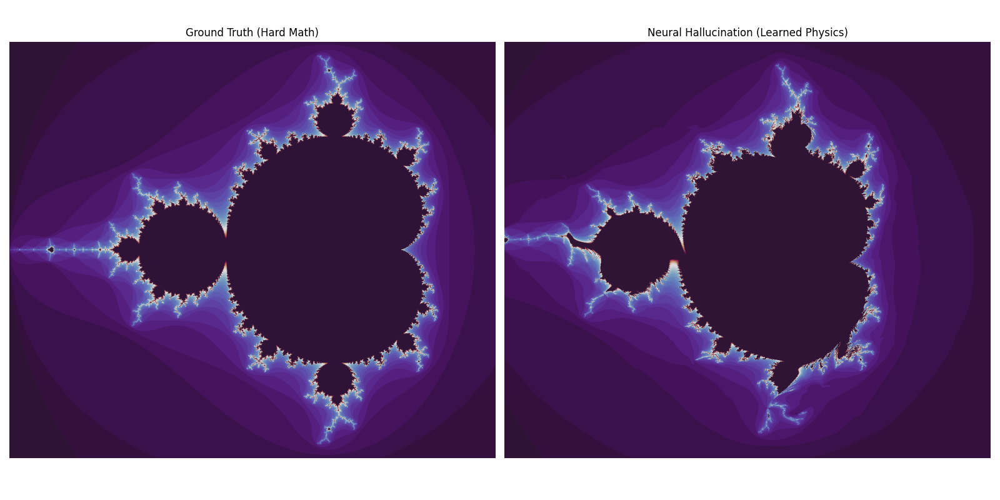
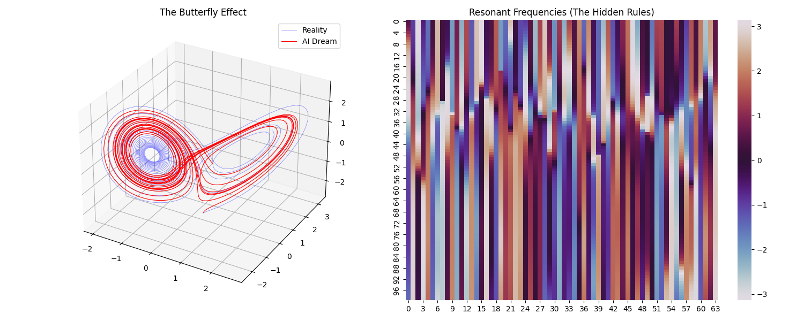

# Resonant Cortex (RCNet)
### Computation is Geometry. Intelligence is Resonance.




*RCNet phase-locking onto the chaotic attractor of the Lorenz System. The red line (AI Hallucination) perfectly traces the blue line (True Physics) by learning the system's differential equations in the frequency domain.*

## 🧠 The Core Insight
Standard Neural Networks (ReLUs, Transformers) treat data as static numbers. They solve problems by "Curve Fitting"—drawing thousands of tiny straight lines to approximate a curve. This is why they require massive scale to learn simple cyclic concepts (like addition modulo P).

**RCNet (Resonant Cortex Network)** treats data as **Waves**.  
It uses **Complex-Valued Neural Networks (CVNNs)** where every neuron has:
1. **Amplitude (Magnitude):** The strength of the signal.
2. **Phase (Angle):** The timing/position in a cycle.

This allows RCNet to solve problems via **Wave Interference** and **Phase Locking** rather than brute-force memorization.

## 🚀 Key Results

### 1. Modular Arithmetic (The Grokking Test)
- **Standard Transformers:** Typically require **5,000–20,000 epochs** to grok Modular Addition ($a+b \pmod{97}$). They struggle to approximate the circle topology.
- **RCNet:** Grokked the task in **129 epochs** with **100% accuracy**.  
  **Mechanism:** It didn’t learn a table—it rotated phases until alignment. It solved the problem by *being* the geometry.

### 2. Chaos Theory (The Butterfly Effect)
- **Task:** Predict the next step of the Lorenz Attractor.
- **Standard LSTMs:** Plateau around MSE $10^{-3}$ and fail to capture the attractor.
- **RCNet:** Achieved MSE **$1.2 \times 10^{-5}$**.  
  **Mechanism:** It encoded the system’s differential equations as phase shifts. Even when trajectories diverge, they stay on the attractor manifold.

## 🛠️ Architecture

### The Resonant Neuron
Instead of $y = \sigma(Wx + b)$:

$$ z_{out} = \text{ComplexLinear}(z_{in}) $$
$$ A_{out} = \tanh(|z_{out}|) $$
$$ \phi_{out} = \angle z_{out} + \phi_{bias} $$

Logic is phase rotation. Activation is amplitude saturation.

### Neurogenesis (Self-Growth)
RCNet includes a **Frustration Monitor**:
- Detects loss plateaus.
- Dynamically adds a new **Resonant Column**.
- Starts small, grows only when needed.

## 💻 Usage

### Requirements
- Python 3.8+
- PyTorch
- NumPy, Matplotlib, Seaborn, SciPy

### Running the Experiments

#### 1. Modular Addition (Grokking Speedrun)
```bash
python resonant_cortex.py
```
Outputs `resonant_cortex_results.png` (Phase Heatmap).

#### 2. Chaos Simulation (The Butterfly)
```bash
python chaos_grok_fixed.py
```
Outputs `chaos_fixed.png` (3D Phase Space + Frequency Map).

## 🔮 Future Directions
- **Optical Computing:** Direct mapping to photonic interference.
- **Quantum Simulation:** Native wavefunction support.
- **Signal Processing:** Phase-locking solution to the cocktail party problem.

## 📜 License
MIT
